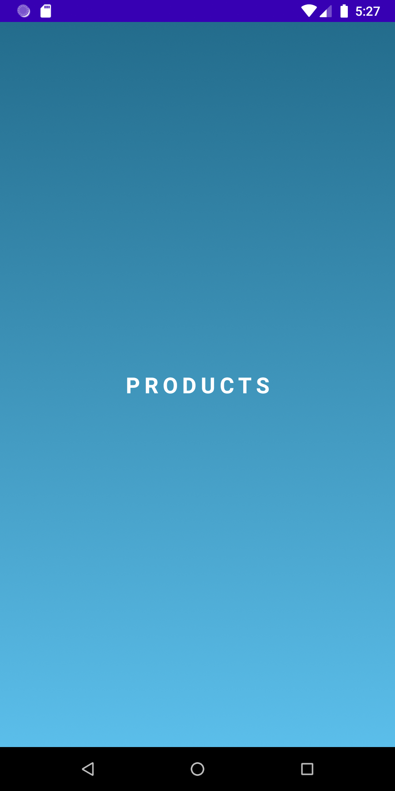
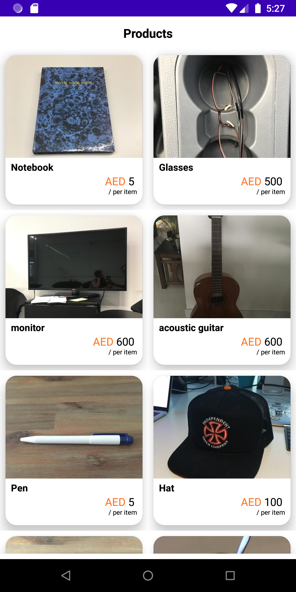
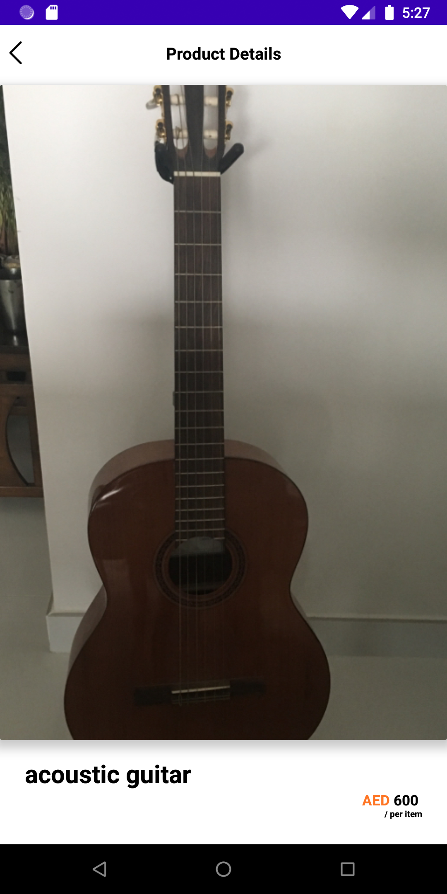

This app is developed using following components:
- Android Kotlin
- MVVM Architectural Pattern
- Navigation component
- Live Data
- Retrofit
- Kotlin Coroutine
- Kotlin Koin
- View Binding
- RXBining

Screen#1

Screen#2

Screen#3

